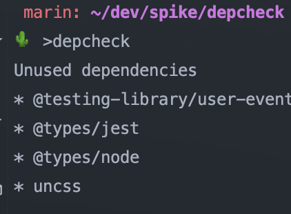

# object of spike

find all dependencies unused in project

# how to set up my project

### install depcheck

```
npm install depcheck
```

### setting a minimal config file

extension **.depcheckrc**
write inside

```text
ignores: ["eslint", "babel-*"]
skip-missing: true
````

## to run

In the project directory, you can run:

``
depcheck
``

without npm run or something like

result 



## more information to usage

[npm page](https://www.npmjs.com/package/depcheck)
 
[github](https://github.com/depcheck/depcheck)